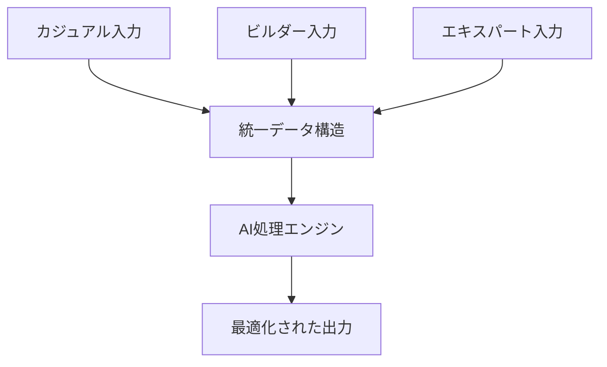

# Universal Story Platform - コンセプト

## ビジョン
「誰もが使えて、AIの能力を最大限引き出せる物語創作プラットフォーム」

## 3つの入力モード

### 1. カジュアルモード（80%のユーザー向け）
```
💬 チャット形式
User: ドラゴンと友達になる少女の話を作りたい
AI: いいですね！少女の年齢はどのくらいですか？
User: 10歳くらいかな
AI: ドラゴンはどんな性格ですか？
```

**特徴**：
- 会話形式で自然に情報収集
- AIが構造化を代行
- 結果は見えるが、過程は隠蔽

### 2. ビルダーモード（15%のユーザー向け）
```
📝 フォーム＋ビジュアル
[キャラクター追加] [場所追加] [イベント追加]

キャラクター：エリナ
├─ 年齢：10歳
├─ 性格：好奇心旺盛
└─ 関係：ドラゴンと友達
```

**特徴**：
- GUIで直感的に構築
- リアルタイムでYAML生成（表示は任意）
- テンプレート豊富

### 3. エキスパートモード（5%のユーザー向け）
```yaml
# 直接YAML編集
story:
  title: "竜と少女の絆"
  world:
    magic_system:
      type: "emotion_based"
      rules:
        - joy: healing_magic
        - anger: fire_magic
```

**特徴**：
- フルコントロール
- AI性能を100%活用
- バージョン管理対応

## データ統合の仕組み



## 技術的実装

### 1. アダプティブUI
```typescript
interface UniversalStoryInput {
  // ユーザーレベルを自動判定
  detectUserLevel(): 'casual' | 'builder' | 'expert';
  
  // モード間の切り替え
  switchMode(from: Mode, to: Mode): void;
  
  // データの相互変換
  convertData(data: any, targetFormat: Format): any;
}
```

### 2. AIアシスタントの段階的支援
```typescript
class AdaptiveAIAssistant {
  // カジュアルモード：全面的に支援
  casualMode = {
    autoStructure: true,
    suggestNext: true,
    fillGaps: true,
  };
  
  // ビルダーモード：部分的に支援
  builderMode = {
    validateStructure: true,
    suggestConnections: true,
    checkConsistency: true,
  };
  
  // エキスパートモード：要求時のみ支援
  expertMode = {
    lintYAML: true,
    optimizeForAI: true,
    benchmarkPerformance: true,
  };
}
```

## 収益モデルの可能性

### フリーミアム
- **無料**: カジュアルモード、基本的なAI生成
- **Pro**: 全モード、高度なAI機能、優先処理
- **Team**: コラボレーション、バージョン管理

### API提供
```yaml
pricing:
  casual_api: $0.001/request
  structured_api: $0.0001/request  # 構造化済みは安い
  enterprise: カスタム料金
```

## なぜこれが機能するか

1. **包括性**: 誰も排除しない
2. **段階的学習**: ユーザーが成長できる
3. **効率性**: 構造化データはAI処理が安い
4. **透明性**: 裏で何が起きているか見せられる

## 実装ロードマップ

### Phase 1: MVP（3ヶ月）
- カジュアルモードの基本実装
- シンプルなYAML変換

### Phase 2: 拡張（6ヶ月）
- ビルダーモード追加
- モード間のシームレスな移行

### Phase 3: 最適化（9ヶ月）
- エキスパートモード
- AI処理の最適化
- APIの公開

## 成功指標

```yaml
metrics:
  adoption:
    - daily_active_users: 10K+
    - mode_distribution: [80%, 15%, 5%]
  
  efficiency:
    - ai_processing_cost: -50%
    - generation_quality: +30%
  
  retention:
    - 30_day_retention: 40%+
    - mode_progression: 10% casual→builder
```